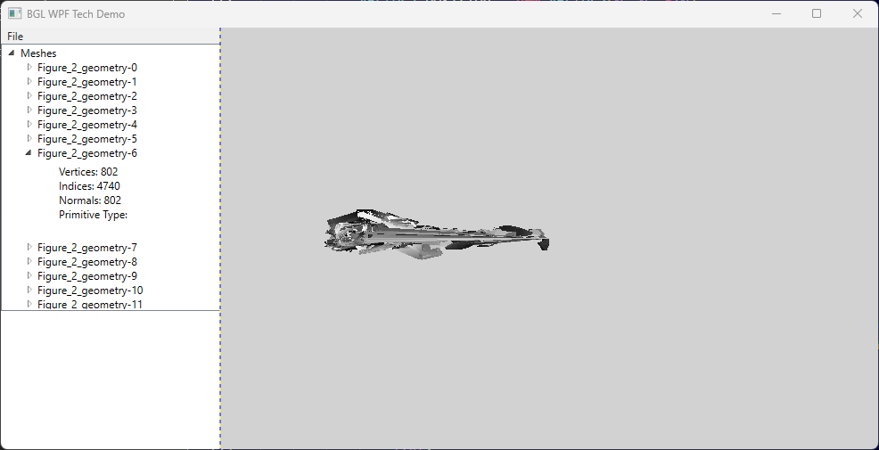

[](https://github.com/bkuolt/bgl-net/actions/workflows/dotnet.yml)



# About
Minimalistic GLTF2 model viewer for __.NET__.  


## Features
- GLTF2 Support
- minimalistic rendering and parsing code
- __.Net Core__ compatible
  - runs on all .NEt Core plattforms with OpenGL 4 support
- __WPF__ Support

# Installation

1) Install dependencies:
    ```PowerShell
    dotnet add package OpenTK --version 4.7.7
    dotnet add package FreeImage-dotnet-core --version 4.3.6
    ```
    dotnet add package SixLabors.ImageSharp --version 3.0.0
2) Clone repository
    ```PowerShell
    git clone https://github.com/bkuolt/bgl-net.git
    ```
3) run
    ```PowerShell
    cd bgl-net
    dotnet run
    ```

## Dependencies
- [OpenTK](https://github.com/opentk/opentk) (OpenGL bindings)
- [WPF OpenTK Control](https://github.com/opentk/GLWpfControl)
- [FreeImage](https://github.com/matgr1/FreeImage-dotnet-core) C bindings (for FPEG and PNG loading)
